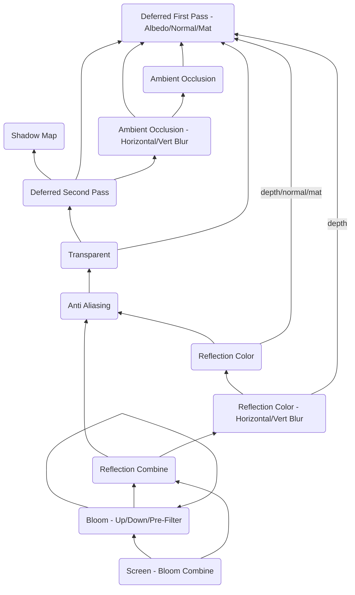

# Dependency graph

```mermaid
graph BT
    Screen(Screen - Bloom Combine) --> Bloom(Bloom - Up/Down/Pre-Filter)
    Screen --> ReflectionCombine(Reflection Combine)
    Bloom --> Bloom
    Bloom --> ReflectionCombine
    ReflectionCombine --> AntiAliasing(Anti Aliasing)
    ReflectionCombine --> ReflectionColorBlur(Reflection Color - Horizontal/Vert Blur)
    ReflectionColorBlur --> ReflectionColor(Reflection Color)
    ReflectionColorBlur -->|depth| DeferredFirstPass(Deferred First Pass - Albedo/Normal/Mat)
    ReflectionColor --> AntiAliasing(Anti Aliasing)
    ReflectionColor -->|depth/normal/mat| DeferredFirstPass
    AntiAliasing --> Transparent(Transparent)
    Transparent --> DeferredSecondPass(Deferred Second Pass)
    DeferredSecondPass --> ShadowMap(Shadow Map)
    DeferredSecondPass --> DeferredFirstPass
    Transparent --> DeferredFirstPass
    DeferredSecondPass --> AmbientOcclusionBlur(Ambient Occlusion - Horizontal/Vert Blur)
    AmbientOcclusionBlur --> DeferredFirstPass
    AmbientOcclusionBlur --> AmbientOcclusion(Ambient Occlusion)
    AmbientOcclusion --> DeferredFirstPass
```
