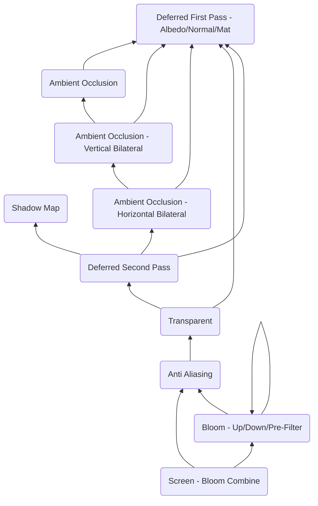

# Dependency graph

```mermaid
graph BT
    Screen(Screen - Bloom Combine) --> Bloom(Bloom - Up/Down/Pre-Filter)
    Bloom --> Bloom
    Bloom --> AntiAliasing(Anti Aliasing)
    Screen --> AntiAliasing
    AntiAliasing --> Transparent(Transparent)
    Transparent --> DefFSecondPass(Deferred Second Pass)
    DefFSecondPass --> H(Shadow Map)
    DefFSecondPass --> DefFirstPass(Deferred First Pass - Albedo/Normal/Mat)
    Transparent --> DefFirstPass
    DefFSecondPass --> AmbientOcclusionHor(Ambient Occlusion - Horizontal Bilateral)
    AmbientOcclusionHor --> DefFirstPass
    AmbientOcclusionHor --> AmbientOcclusionVert(Ambient Occlusion - Vertical Bilateral)
    AmbientOcclusionVert --> DefFirstPass
    AmbientOcclusionVert --> AmbientOcclusion(Ambient Occlusion)
    AmbientOcclusion --> DefFirstPass
```
