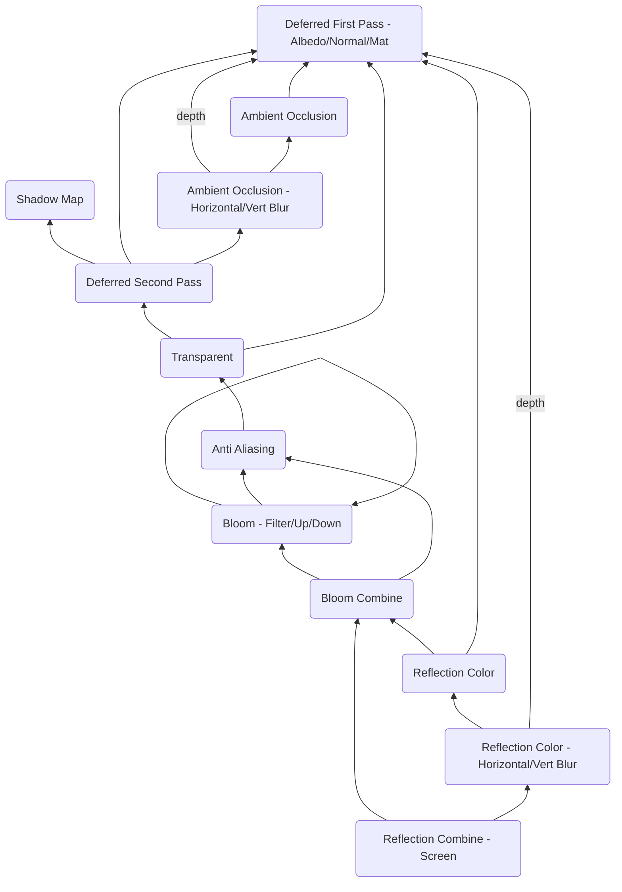

# Dependency graph

```mermaid
graph BT
    ReflectionCombine(Reflection Combine - Screen) --> BloomCombine(Bloom Combine)
    ReflectionCombine --> ReflectionColorBlur(Reflection Color - Horizontal/Vert Blur)
    ReflectionColorBlur --> ReflectionColor(Reflection Color)
    ReflectionColorBlur -->|depth| DeferredFirstPass(Deferred First Pass - Albedo/Normal/Mat)
    ReflectionColor --> BloomCombine
    BloomCombine --> BloomFilterUpDown(Bloom - Filter/Up/Down)
    BloomCombine --> AntiAliasing(Anti Aliasing)
    BloomFilterUpDown --> BloomFilterUpDown
    BloomFilterUpDown --> AntiAliasing
    ReflectionColor --> DeferredFirstPass
    AntiAliasing --> Transparent(Transparent)
    Transparent --> DeferredSecondPass(Deferred Second Pass)
    DeferredSecondPass --> ShadowMap(Shadow Map)
    DeferredSecondPass --> DeferredFirstPass
    Transparent --> DeferredFirstPass
    DeferredSecondPass --> AmbientOcclusionBlur(Ambient Occlusion - Horizontal/Vert Blur)
    AmbientOcclusionBlur -->|depth| DeferredFirstPass
    AmbientOcclusionBlur --> AmbientOcclusion(Ambient Occlusion)
    AmbientOcclusion --> DeferredFirstPass
```
