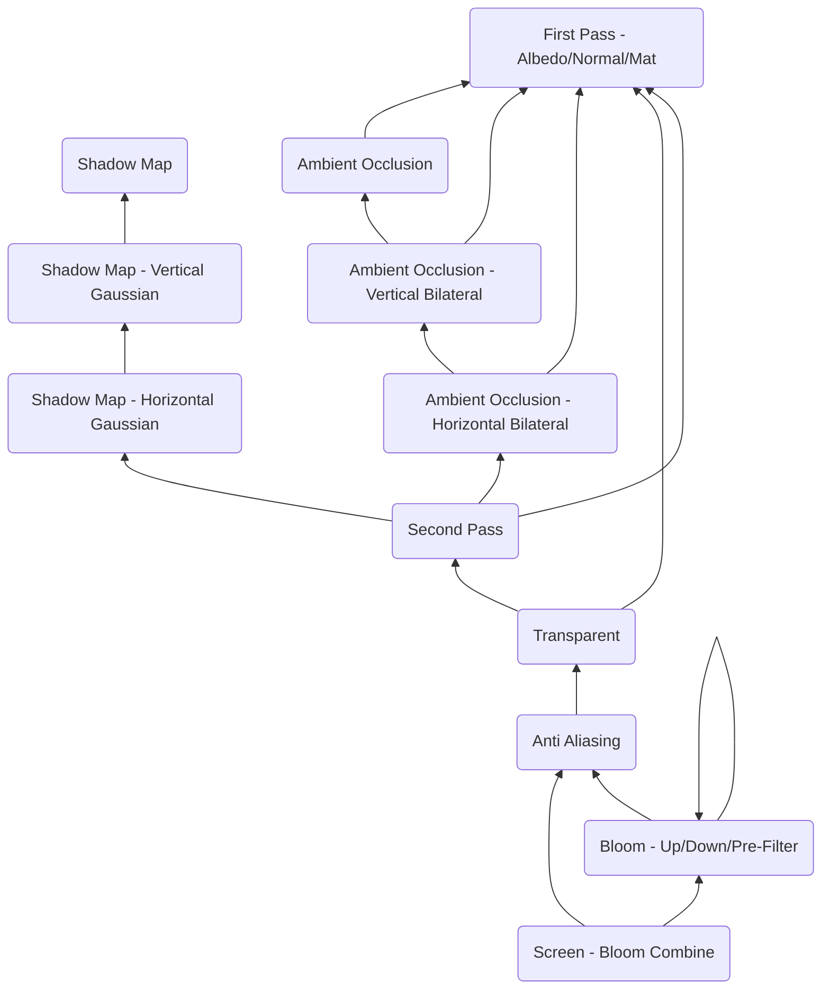

# Dependency graph

```mermaid
graph BT
    A(Screen - Bloom Combine) -->B(Bloom - Up/Down/Pre-Filter)
    B --> B
    B --> C(Anti Aliasing)
    A --> C
    C --> D(Transparent)
    D --> E(Second Pass)
    E --> F(Shadow Map - Horizontal Gaussian)
    F --> G(Shadow Map - Vertical Gaussian)
    G --> H(Shadow Map)
    E --> K(First Pass - Albedo/Normal/Mat)
    D --> K
    E --> M(Ambient Occlusion - Horizontal Bilateral)
    M --> K
    M --> N(Ambient Occlusion - Vertical Bilateral)
    N --> K
    N --> O(Ambient Occlusion)
    O --> K
```
