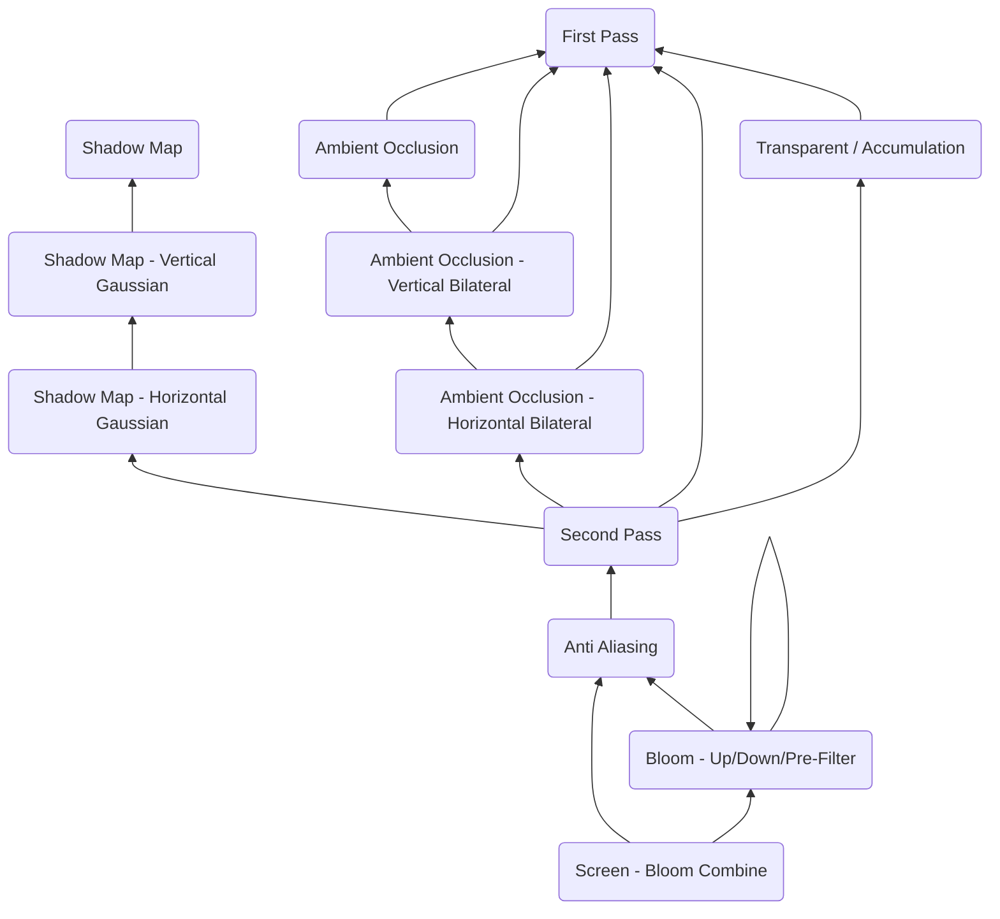

# Dependency graph

```mermaid
graph BT
A(Screen - Bloom Combine) -->B(Bloom - Up/Down/Pre-Filter)
    B --> B
    B --> C(Anti Aliasing)
    A --> C
    C --> D(Second Pass)
    D --> E(Shadow Map - Horizontal Gaussian)
    E --> F(Shadow Map - Vertical Gaussian)
    F --> G(Shadow Map)
    
    D --> I(Transparent / Accumulation)
    I --> J(First Pass)
    D --> J
    
    D --> L(Ambient Occlusion - Horizontal Bilateral)
    L --> J
    L --> M(Ambient Occlusion - Vertical Bilateral)
    M --> J
    M --> N(Ambient Occlusion)
    N --> J
```
