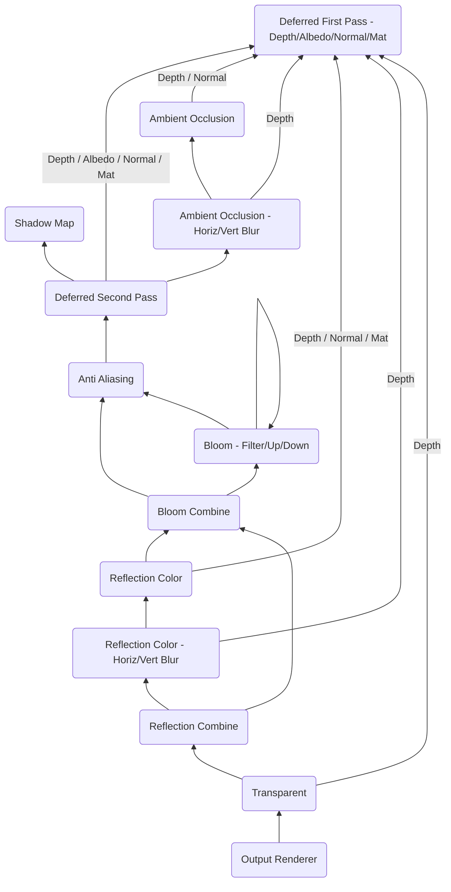

# Dependency graph

```mermaid
graph BT
    DeferredFirstPass(Deferred First Pass - Depth/Albedo/Normal/Mat)
    ShadowMap(Shadow Map)
    AmbientOcclusion(Ambient Occlusion)
    AmbientOcclusionBlur(Ambient Occlusion - Horiz/Vert Blur)
    DeferredSecondPass(Deferred Second Pass)
    AntiAliasing(Anti Aliasing)
    BloomFilterUpDown(Bloom - Filter/Up/Down)
    BloomCombine(Bloom Combine)
    ReflectionColor(Reflection Color)
    ReflectionColorBlur(Reflection Color - Horiz/Vert Blur)
    ReflectionCombine(Reflection Combine)
    Transparent(Transparent)
    OutputRenderer(Output Renderer)
    
    
    DeferredSecondPass --> ShadowMap
    DeferredSecondPass -->|Depth / Albedo / Normal / Mat| DeferredFirstPass
    DeferredSecondPass --> AmbientOcclusionBlur
    
    AmbientOcclusion -->|Depth / Normal| DeferredFirstPass
    AmbientOcclusionBlur -->|Depth| DeferredFirstPass
    AmbientOcclusionBlur --> AmbientOcclusion
    
    AntiAliasing --> DeferredSecondPass
    
    BloomCombine --> BloomFilterUpDown
    BloomCombine --> AntiAliasing
    BloomFilterUpDown --> BloomFilterUpDown
    BloomFilterUpDown --> AntiAliasing
    
    ReflectionColor --> BloomCombine
    ReflectionColor -->|Depth / Normal / Mat| DeferredFirstPass
    ReflectionCombine --> BloomCombine
    ReflectionCombine --> ReflectionColorBlur
    ReflectionColorBlur --> ReflectionColor
    ReflectionColorBlur -->|Depth| DeferredFirstPass
    
    Transparent --> ReflectionCombine
    Transparent -->|Depth| DeferredFirstPass
    
    OutputRenderer --> Transparent
```
