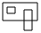

:toc:

== Nav mesh generation - overview
* _Input:_ `AIWorld` (updated by aggregation)
* `NavMeshGenerator::updateExpandedPolytopes()`:
** For each new or updated `AIObject` in scene:
*** Create or update the `NavObject`
*** Compute expanded polytope and determine walkable surfaces
* `NavMeshGenerator::prepareNavObjectsToUpdate()`:
** Refresh near objects on objects
** Determine objects requiring an update and add them in *navObjectsToRefresh*
** Determine objects requiring links update only and add them in *navObjectsLinksToRefresh*
* `NavMeshGenerator::deleteNavLinks`:
** For each *navObjectsLinksToRefresh*:
*** Delete links
* `NavMeshGenerator::updateNavPolygons()`:
** For each *navObjectsToRefresh* and each walkable surfaces:
*** Walkable surface: +
image:navmesh/ws.png[ws]
*** Find all obstacles of the walkable surface: +

*** Subtract obstacles on walkable surface outline: +
image:navmesh/subtract.png[su]
*** Triangulate with remaining obstacles: +
image:navmesh/triang.png[tr]
* `NavMeshGenerator::createNavLinks()`:
** For each *navObjectsToRefresh* and for each *navObjectsLinksToRefresh*:
*** Create links
* `NavMeshGenerator::updateNavMesh()`:
** Copy all `NavPolygon` into `NavMesh`

== Pathfinding - naming
image:pathfinding/pathfindingNaming.png[pa]

* Legend:
** [red black-background]*Red*: `PathNode` is link between two `NavTriangle` which belong to the path.
** [green black-background]*Green*: `PathPortal` is a line segment between two `PathNode`.
** [blue black-background]*Blue*: `PathPortal#getTransitionPoint()` represents a transition (turning point, jump start/end, different topography) in the path. Turning points are determined by the funnel algorithm.
** [fuchsia black-background]*Fuchsia*: `PathPoint` represents a point of the final path. They are basically the transition points + others points to follow the topography.
