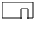

:toc:

== Nav mesh generation - overview
* _Input:_ `AIWorld` (updated by mapHandler)
* Create empty `NavMesh` object
* `NavMeshGenerator::updateExpandedPolytopes()`:
** For each new or updated `AIObject` in scene:
*** Create or update a `NavObject` and add it in *navObjectsToRefresh*
*** Compute expanded polytope and determine walkable surfaces
* `NavMeshGenerator::updateNearObjects()`:
** For each *navObjectsToRefresh*
*** Determine the near objects and add them in *newAffectedNavObjects*
** For each *newAffectedNavObjects*
*** Determine the near objects
** Add all *newAffectedNavObjects* in *navObjectsToRefresh*
* `NavMeshGenerator::updateNavPolygons()`:
** For each *navObjectsToRefresh* and each walkable surfaces:
*** Walkable surface: +
image:navmesh/ws.png[ws]
*** Find all obstacles of the walkable surface: +
image:navmesh/obstacles.png[ob]
*** Subtract obstacles on walkable surface outline: +

*** Triangulate with remaining obstacles: +
image:navmesh/triang.png[tr]
* Add `NavPolygon` to `NavMesh`
