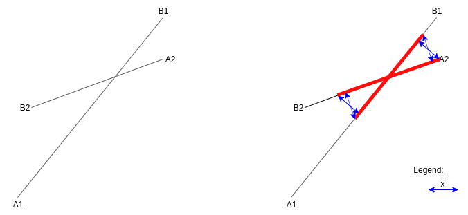

:toc:

== Nav mesh generation - overview
* _Input:_ `AIWorld` (updated by mapHandler)
* Create empty `NavMesh` object
* `NavMeshGenerator::updateExpandedPolytopes()`:
** For each new or updated `AIObject` in scene:
*** Create or update a `NavObject` and add it in *navObjectsToRefresh*
*** Compute expanded polytope and determine walkable surfaces
* `NavMeshGenerator::updateNearObjects()`:
** For each *navObjectsToRefresh*
*** Determine the near objects and add them in *newAffectedNavObjects*
** For each *newAffectedNavObjects*
*** Determine the near objects
** Add all *newAffectedNavObjects* in *navObjectsToRefresh*
* `NavMeshGenerator::updateNavPolygons()`:
** For each *navObjectsToRefresh* and each walkable surfaces:
*** Walkable surface: +
image:navmesh/ws.png[ws]
*** Find all obstacles of the walkable surface: +
image:navmesh/obstacles.png[ob]
*** Subtract obstacles on walkable surface outline: +
image:navmesh/subtract.png[su]
*** Triangulate with remaining obstacles: +
image:navmesh/triang.png[tr]
* Add `NavPolygon` to `NavMesh`

== Edges jump detection
[underline]#Input#: two edges defined each by points latexmath:[A_1 B_1] and latexmath:[A_2 B_2] +
[underline]#Goal#: find sub-edge (red) where a jump of length latexmath:[x] can be done from latexmath:[A_2 B_2] to latexmath:[A_1 B_1]. +

[underline]#Solution#: +
Projection of a point latexmath:[P] on line latexmath:[A_1 B_1] is defined by (see: `LineSegment3D<T>::closestPoint()`): +
latexmath:[{(B_1-A_1)\bullet(P-A_1) \over \|B_1-A_1\|^2} (B_1-A_1) + A_1]

So, the vector measuring the orthogonal distance from latexmath:[A_1 B_1] to latexmath:[P] is: +
latexmath:[D=P-\left \{ {(B_1-A_1)\bullet(P-A_1) \over \|B_1-A_1\|^2} (B_1-A_1) + A_1\right \}]

Every point latexmath:[$P$] on the line segment latexmath:[A_2 B_2] has the form: +
latexmath:[P=\alpha A_2+(1-\alpha)B_2] for latexmath:[\alpha \in [0,1]]

So, we can write latexmath:[$D$] in the form: +
latexmath:[D={\alpha A_2+(1-\alpha)B_2} - \left \{ {(B_1-A_1)\bullet(\alpha A_2+(1-\alpha)B_2-A_1) \over \|B_1-A_1\|^2} (B_1-A_1) + A_1\right \}]

The above equation is linear (latexmath:[ax + b]). It implies that there are constants vectors latexmath:[c_0, c_1] such as: +
latexmath:[D=c_0\alpha + c_1]

Let's transform the above equation to get these constants: +
latexmath:[D=\alpha A_2+(1-\alpha)B_2-A_1 - {(B_1-A_1)\bullet(\alpha A_2+(1-\alpha)B_2-A_1) \over \|B_1-A_1\|^2} (B_1-A_1)] +
latexmath:[D=(A_2-B_2)\alpha +B_2-A_1 - {(B_1-A_1)\bullet((A_2-B_2)\alpha +B_2-A_1) \over \|B_1-A_1\|^2} (B_1-A_1)] +
latexmath:[D=(A_2-B_2)\alpha +B_2-A_1 - {\alpha(B_1-A_1)\bullet(A_2-B_2) + (B_1-A_1)\bullet (B_2-A_1) \over \|B_1-A_1\|^2} (B_1-A_1)] +
latexmath:[D=(A_2-B_2)\alpha +B_2-A_1 - \alpha{(B_1-A_1)\bullet(A_2-B_2) \over \|B_1-A_1\|^2}(B_1-A_1) - {(B_1-A_1)\bullet (B_2-A_1) \over \|B_1-A_1\|^2}(B_1-A_1)] +
latexmath:[D=\left \{ A_2-B_2-{(B_1-A_1)\bullet(A_2-B_2) \over \|B_1-A_1\|^2}(B_1-A_1)\right \}\alpha + \left \{ B_2-A_1-{(B_1-A_1)\bullet (B_2-A_1) \over \|B_1-A_1\|^2}(B_1-A_1)\right \}]

[big yellow]#latexmath:[c_{0}=A_2-B_2-{(B_1-A_1)\bullet(A_2-B_2) \over \|B_1-A_1\|^2}(B_1-A_1)]# +
[big yellow]#latexmath:[c_{1}=B_2-A_1-{(B_1-A_1)\bullet (B_2-A_1) \over \|B_1-A_1\|^2}(B_1-A_1)]#

We need to find solution to the following equation: +
latexmath:[\|D\|^2 \le x^2] +
latexmath:[D_x^2 + D_y^2 + D_z^2 \le x^2] +
latexmath:[(c_{0x}\alpha + c_{1x})^2 + (c_{0y}\alpha + c_{1y})^2 + (c_{0z}\alpha + c_{1z})^2 \le x^2] +
latexmath:[(c_{0x}^2+c_{0y}^2+c_{0z}^2)\alpha^2 + 2(c_{0x}c_{1x}+c_{0y}c_{1y}+c_{0z}c_{1z})\alpha + (c_{1x}^2 + c_{1y}^2 + c_{1z}^2) \le x^2]

Last equation is a quadratic equation (latexmath:[ax^2 + bx + c]) where we can find both roots (latexmath:[r_1, r_2]) for: +
latexmath:[(c_{0x}^2+c_{0y}^2+c_{0z}^2)\alpha^2 + 2(c_{0x}c_{1x}+c_{0y}c_{1y}+c_{0z}c_{1z})\alpha + (c_{1x}^2 + c_{1y}^2 + c_{1z}^2 - x^2) = 0]
[big yellow]#latexmath:[r_{\{1,2\}}={-2(c_{0x}c_{1x}+c_{0y}c_{1y}+c_{0z}c_{1z}) \pm \sqrt{(2(c_{0x}c_{1x}+c_{0y}c_{1y}+c_{0z}c_{1z}))^2 - 4 * (c_{0x}^2+c_{0y}^2+c_{0z}^2) * (c_{1x}^2 + c_{1y}^2 + c_{1z}^2 - x^2)} \over 2 * (c_{0x}^2+c_{0y}^2+c_{0z}^2)}]# +

The variables latexmath:[r_1, r_2] must be clamped between 0, 1. Finally, the red segment points can be found with: +
[big yellow]#latexmath:[S_1=r_1A_2+(1-r_1)B_2]# +
[big yellow]#latexmath:[S_2=r_2A_2+(1-r_2)B_2]#
