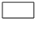

# Nav mesh generation algorithm
* __Input:__ `AIWorld` (updated by mapHandler)
* Create empty `NavMesh` object
* __NavMeshGenerator::updateExpandedPolytopes()__:
  * For each new or updated `AIObject` in scene:
    * Create or update a `NavObject` and add it in *navObjectsToRefresh*
    * Compute expanded polytope and determine walkable surfaces
* __NavMeshGenerator::updateNavObstacles()__:
  * For each *navObjectsToRefresh*
    * Determine the obstacles and add them in *newAffectedNavObjects*
  * For each *newAffectedNavObjects*
    * Determine the obstacles
  * Add all *newAffectedNavObjects* in *navObjectsToRefresh*
* __NavMeshGenerator::updateNavPolygons()__:
  * For each *navObjectsToRefresh* and each walkable surfaces:
    * Walkable surface:   
    * Find all obstacles of the walkable surface:   
    * Subtract obstacles on walkable surface outline:   
    * Triangulate with remaining obstacles:   
* Add `NavPolygon` to `NavMesh`
